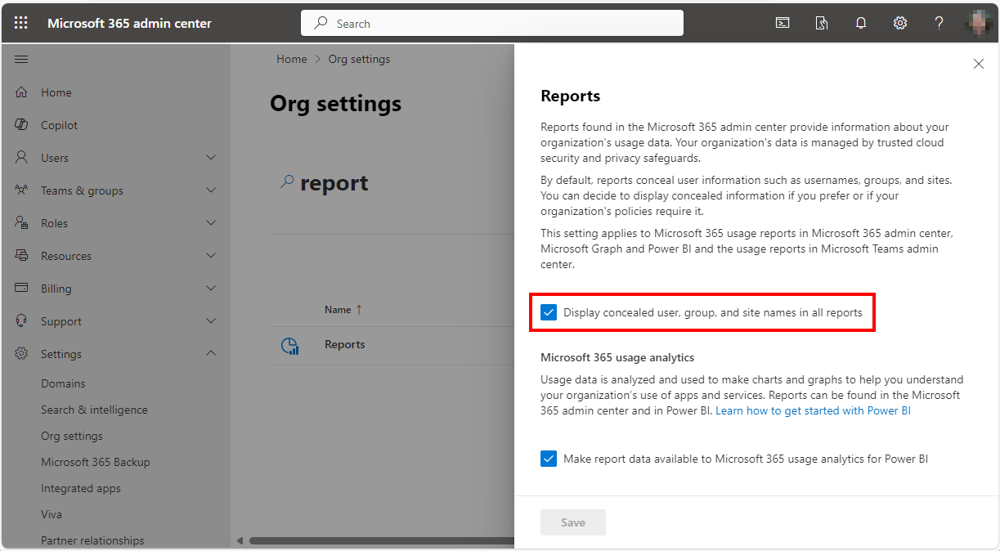
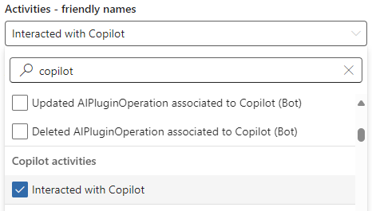
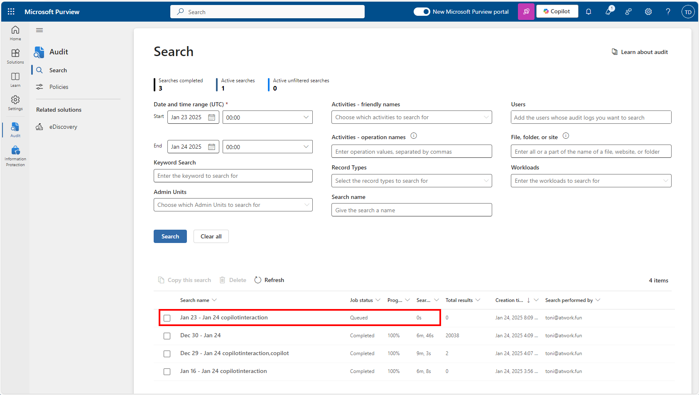
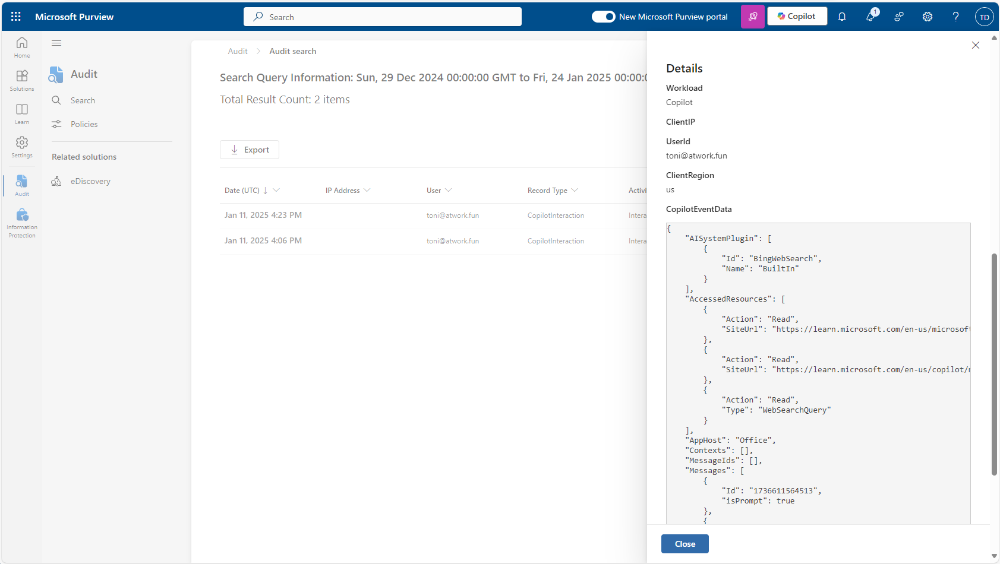
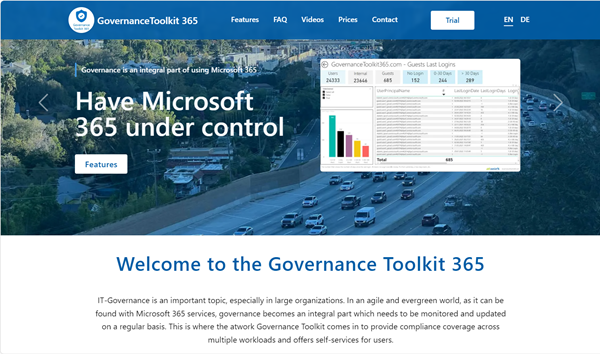

# Copilot Usage

For administrators, it is vital to know which users are utilizing a Copilot license and the specific services they are engaging with. This information helps in managing licenses effectively, ensuring that resources are allocated efficiently. 

## Get Copilot Usage with Graph Reports

Admins can use the Microsoft Graph API to get the M365 Copilot usage per user. This method is currently only available in Graph Beta. See the available endpoint documentation here:

- [getMicrosoft365CopilotUserCountSummary](https://learn.microsoft.com/en-us/graph/api/reportroot-getmicrosoft365copilotusercountsummary?view=graph-rest-beta&tabs=http&WT.mc_id=AZ-MVP-4030574)
- [getMicrosoft365CopilotUserCountTrend](https://learn.microsoft.com/en-us/graph/api/reportroot-getmicrosoft365copilotusercounttrend?view=graph-rest-beta&tabs=http&WT.mc_id=AZ-MVP-4030574)
- [getMicrosoft365CopilotUsageUserDetail](https://learn.microsoft.com/en-us/graph/api/reportroot-getmicrosoft365copilotusageuserdetail?view=graph-rest-beta&tabs=http&WT.mc_id=AZ-MVP-4030574)

### Create an App

Create an entra ID app first and add the required permissions to get access to the Graph endpoints and use the app data for authorization in your request, as here.

- *Headers:*
- Content-Type: application/json
- *Body:*
- Authority: https://login.microsoft.com
- Tenant: [your-tenantid]
- Audience: https://graph.microsoft.com/
- Client ID: [your-appid]
- Secret: [your-secret]

The following request requires the *Reports.Read.All* permission and returns usage data of uisers for the last 7 days:

~~~
GET https://graph.microsoft.com/beta/reports/getMicrosoft365CopilotUsageUserDetail(period='D7')
~~~

The supported values for the period are *D7, D30, D90, D180*, and *ALL* (where *ALL* equals *D180*). The response looks similar as here:

~~~json
{
    "value": [
        {
            "reportRefreshDate": "2025-01-21",
            "userPrincipalName": "AdeleV@mytenant.onmicrosoft.com",
            "displayName": "Adele Vance",
            "lastActivityDate": "2024-12-21",
            "copilotChatLastActivityDate": "",
            "microsoftTeamsCopilotLastActivityDate": "",
            "wordCopilotLastActivityDate": "",
            "excelCopilotLastActivityDate": "",
            "powerPointCopilotLastActivityDate": "",
            "outlookCopilotLastActivityDate": "2024-12-21",
            "oneNoteCopilotLastActivityDate": "",
            "loopCopilotLastActivityDate": "",
            "copilotActivityUserDetailsByPeriod": [
                { "reportPeriod": 7 }
            ]
        },
        {
            [..next user...]
        }
    ]
}
~~~

This provides the latest activity data for users who have used the listed Microsoft 365 Copilot apps. But there is a catch.

### Organizational Reports Settings

As an administrator of a Microsoft 365 tenant, we have the ability to enable the obfuscation of user data in reports. This setting can be managed directly within the Admin portal, in *Settings / Org settngs / Reports*, as here (see also Governance Toolkit 365-Turn off obfuscation).

The switch *"Display concealed user, group, and site names in all reports"* controls if usernames are visible or obfuscated:

- ON: Show anonymized usernames
- OFF: Show usernames

Many organizations leave anonymization active. This means that anonymous usernames are displayed in reports, as below.

### Report Copilot Usage with anonymized usernames

When the setting above is enabled, the Graph query returns random user data like in this sample: the userPrinicipalName and displayName properties are random numbers instead of useful names.

~~~json
{
    "value": [
        {
            "reportRefreshDate": "2025-01-21",
            "userPrincipalName": "04ED172AFFD17C931C567960999335F9",
            "displayName": "55F1D13D475D53DD4FA55E740CDD4032",
            "lastActivityDate": "2024-12-21",
            ...,
            "copilotActivityUserDetailsByPeriod": [
                { "reportPeriod": 7 }
            ]
        },
        {
            [..next anonymized user...]
        }
    ]
}
~~~

We cannot draw any conclusions about the users, their company, department or region. So, we need an alternative method here.

## Using the Microsoft 365 Security Audit Logs

To our rescue: The Microsoft 365 Security Audit Logs provide a comprehensive view of user activities, including interactions with Copilot. These logs capture detailed information about each interaction, such as the user involved, the time of the interaction, and the specific actions taken. This level of detail is essential for administrators who need to monitor usage patterns, identify potential issues, and ensure compliance with organizational policies. Thankfully, access to M365 Copilot can also be found here.

### Search in the Purview Portal

To do this interactively, an administrator can open the Microsoft Purview portal and the *Audit / Search* menu at https://purview.microsoft.com/audit/auditlogsearch. We can select the date and time range, and search for the *"Copilot activities"*. We select *"Interacted with Copilot"*, as here.

When you click the Search button, the search is added to a queue and the form is reset. It may take some time for the search to be processed.

When the search is completed, we should find matching records. In this sample, a user used the Copilot Web search. The data can be exported as CSV file (and this takes a while to be generated as well).

The key benefits of using security audit logs are:

- Detailed User Information: Unlike anonymized Graph Reports, Security Audit Logs provide specific user details, allowing administrators to track individual usage patterns and identify high-value users or potential misuse.
- Comprehensive Activity Tracking: Audit logs capture a wide range of activities, including interactions with Copilot, making it easier to understand how users are leveraging the tool across different services.
- Compliance and Security: Detailed logs help organizations meet compliance requirements by providing a clear record of user activities, which is essential for audits and security investigations.

The disadvantages of using security audit logs are:

- Time-Consuming Search Queries: Search queries in Security Audit Logs can take a long time to process. This delay can hinder timely access to critical information.
- High Processing Costs: The processing of useful data from Security Audit Logs can be very costly. This includes both computational resources and the time required to analyze the data effectively.

Unfortunately, there is currently no ready-to-use connector to feed that data into another storage, like an Azure Log Analytics workspace, or similar. The M365 Sentinel data connector does not include audit log data with Copilot usage.

However, here we get Copilot usage data, even if the org settings obfuscation report settings are enabled. Therefore, it is legitimate to use this data for reports on the use of Copilot. This can be used to encourage users to use Copilot better or to optimize licenses.

### Access the Security Audit Logs from Graph

To access and filter the Security Audit Logs for Copilot interactions, you can use the Microsoft Graph API, too. This method is currently only available in Graph Beta. This endpoint requires the AuditLogsQuery.Read.All permission. The concept is the same as in the Purview portal: Create a new query, and check the status of the job. When the result is generated, you can access it. You can find the documentation at

- [auditLogQuery resource type](https://learn.microsoft.com/en-us/graph/api/resources/security-auditlogquery?view=graph-rest-beta&WT.mc_id=AZ-MVP-4030574)
- [Create auditLogQuery](https://learn.microsoft.com/en-us/graph/api/security-auditcoreroot-post-auditlogqueries?view=graph-rest-beta&tabs=http&WT.mc_id=AZ-MVP-4030574)
- [List auditLogQueries](https://learn.microsoft.com/en-us/graph/api/security-auditcoreroot-list-auditlogqueries?view=graph-rest-beta&tabs=http&WT.mc_id=AZ-MVP-4030574)
- [Get auditLogQuery](https://learn.microsoft.com/en-us/graph/api/security-auditlogquery-get?view=graph-rest-beta&tabs=http&WT.mc_id=AZ-MVP-4030574)
- [List auditLogRecords](https://learn.microsoft.com/en-us/graph/api/security-auditlogquery-list-records?view=graph-rest-beta&tabs=http&WT.mc_id=AZ-MVP-4030574)

Here's an example how to work with search queries in Graph.  

~~~json
Create a search query:
POST https://graph.microsoft.com/beta/security/auditLog/queries

{
  "@{concat('@','odata.context')}": "https://graph.microsoft.com/beta/$metadata#security/auditLog/queries/$entity",
  "displayName": "copilotusage-@{utcNow()}",
  "filterStartDateTime": "2025-01-30T00:00:00Z",
  "filterEndDateTime": "2025-02-05T00:00:00Z",
  "recordTypeFilters": [],
  "keywordFilter": "",
  "serviceFilters": [],
  "operationFilters": [
    "copilotinteraction"
  ],
  "userPrincipalNameFilters": [],
  "ipAddressFilters": [],
  "objectIdFilters": [],
  "administrativeUnitIdFilters": []
}

Once this is done: Get a list of search queries including their status:
GET https://graph.microsoft.com/beta/security/auditLog/queries

Get the status of one specific search query:
GET https://graph.microsoft.com/beta/security/auditLog/queries/<queryid> 

Get the result of a search query (when "status": "succeeded"):
GET https://graph.microsoft.com/beta/security/auditLog/queries/<queryid>/records 
~~~

Here´s a (shortened) sample result. Note that the including data depends on the service itself, so the auditData can look completely different for various services.

~~~json
{
    "@odata.context": "https://graph.microsoft.com/beta/$metadata#security/auditLog/queries('1177737b-a8ed-4e8c-acb8-d4c2201f2af5')/records",
    "@odata.count": 2,
    "@microsoft.graph.tips": "Use $select ...: GET security/auditLog/queries('<guid>')/records?$select=administrativeUnits,auditData",
    "value": [
        {
            "id": "<someid>",
            "createdDateTime": "2025-01-11T16:23:43Z",
            "operation": "CopilotInteraction",
            "userId": "<userid>",
            "userPrincipalName": "AdeleV@mytenant.onmicrosoft.com",
            "clientIp": null,
            "administrativeUnits": [ "" ],
            "auditData": {
                "Operation": "CopilotInteraction",
                ...,
                "CopilotEventData": {
                    "AppHost": "Outlook",
                    "ThreadId": "<someid>@thread.v2",
                    "Messages": [
                        {
                            "Id": "1736612623080",
                            "isPrompt": true
                        },
                        {
                            "Id": "1736612623381",
                            "isPrompt": false
                        }
                    ],
                    "AccessedResources": [
                        {
                            "Action": "Read",
                            "SiteUrl": "https://outlook.office365.com/owa/?ItemID=<someid>&exvsurl=1&viewmodel=ReadMessageItem",
                            "Type": "http://schema.skype.com/HyperLink"
                        },
                        {
                            "Action": "Read",
                            "SiteUrl": "https://outlook.office365.com/owa/?ItemID=<someid>&exvsurl=1&viewmodel=ReadMessageItem",
                            "Type": "http://schema.skype.com/HyperLink"
                        }
                    ]
                }
            }
        },
        {
            [...next item...]
        }
    ]
}
~~~

The result therefore provides more or less at least information about the users and the type of copilot request.

## More resources

In addition to the Microsoft Graph documentation find more resources here:

- [Search the audit log](https://learn.microsoft.com/en-us/purview/audit-search?view=o365-worldwide&tabs=microsoft-purview-portal&WT.mc_id=AZ-MVP-4030574)
- [The four ways to build your own Copilot usage & adoption reports](https://www.loryanstrant.com/2025/01/13/the-four-ways-to-build-your-own-copilot-usage-adoption-reports/)
- [Hijacking Viva Insights to build a meaningful Microsoft 365 Copilot usage report](https://www.loryanstrant.com/2025/01/22/hijacking-viva-insights-to-build-a-meaningful-microsoft-365-copilot-usage-report/)

## Conclusion

Although graph reports are useful for general insights and trend analysis, they fail when the organization's report anonymization feature is enabled. In this case, Security Audit Logs provide the granularity needed to make informed decisions about the usage of Copilot. For administrators seeking detailed insights into Microsoft 365 Copilot usage, Security Audit Logs offer a powerful alternative to Graph Reports. By leveraging these logs, organizations can gain a clearer understanding of how Copilot is being used, identify opportunities for improvement, and ensure compliance with internal and external requirements.

Use it now!

The reports on the use of M365 Copilot are part of our ready-to-use [Governance Toolkit 365](https://governancetoolkit365.com/).
In addition to these reports, you will find a number of ready-made solutions for Microsoft 365 to use in your environment there.

